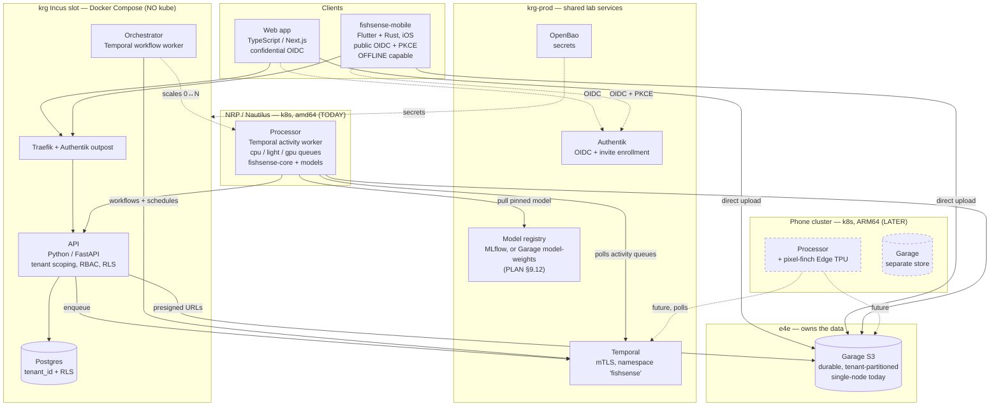
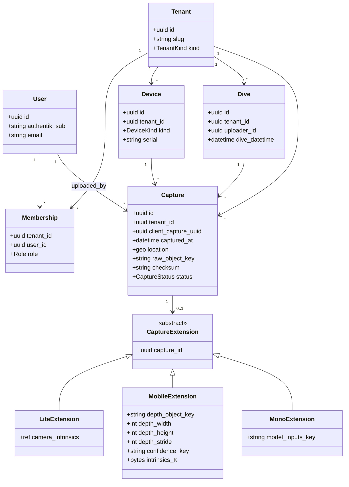
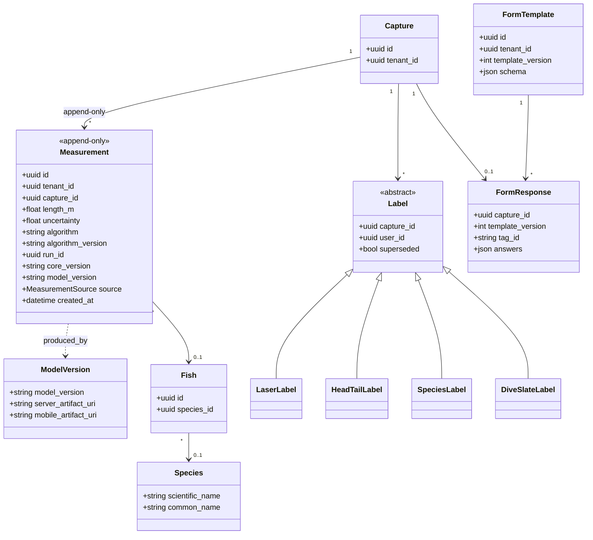
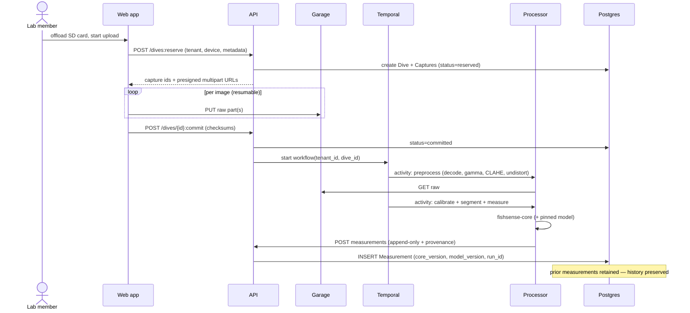
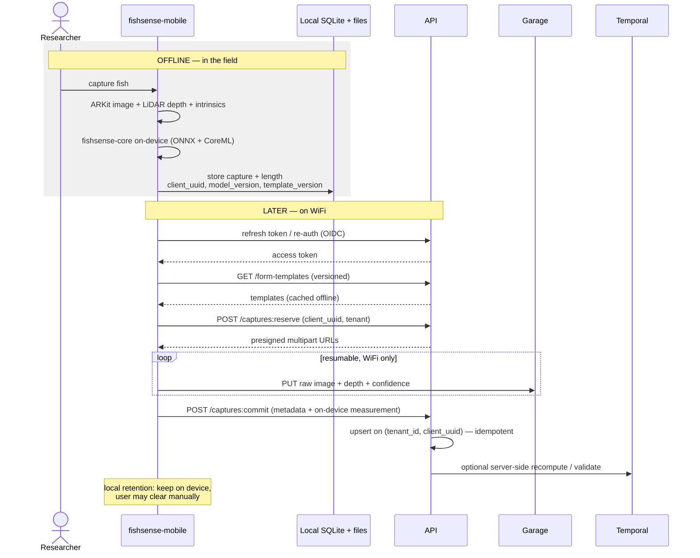
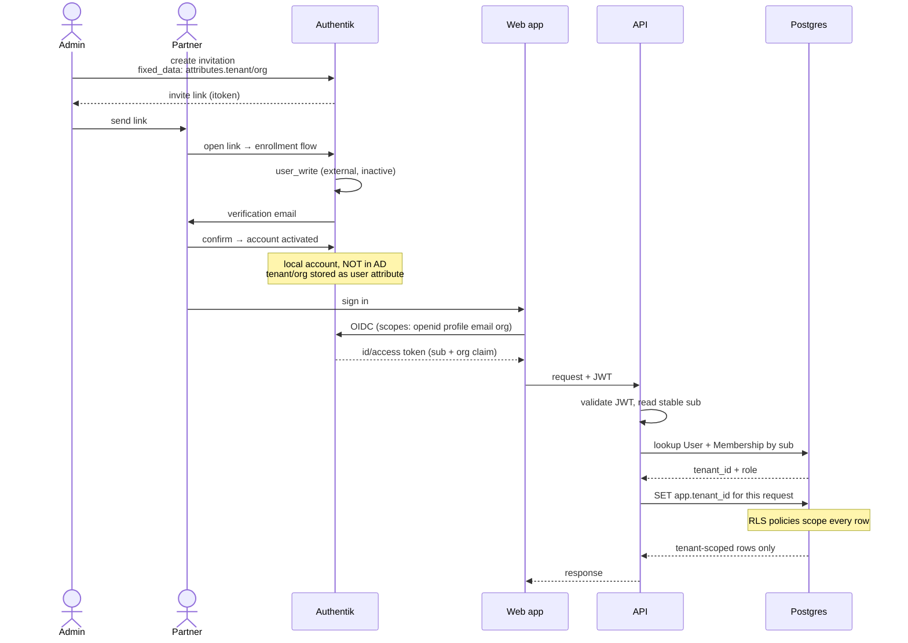
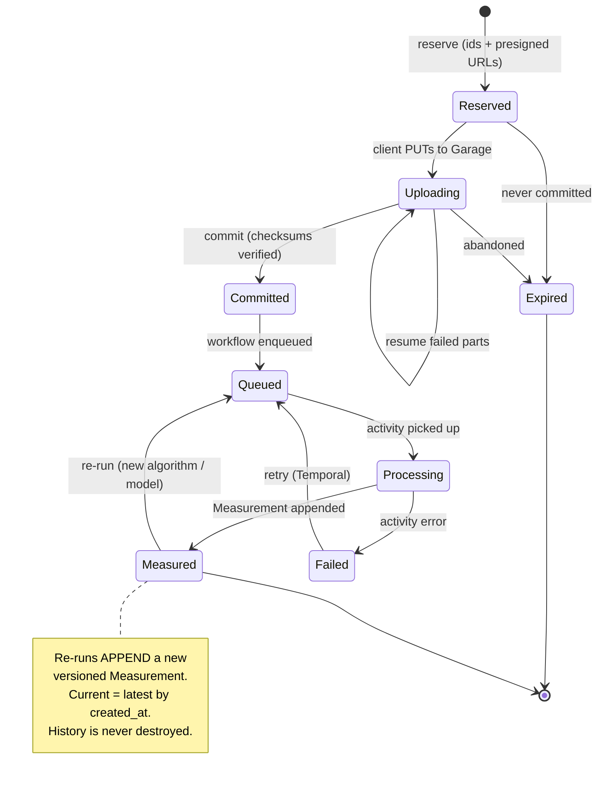
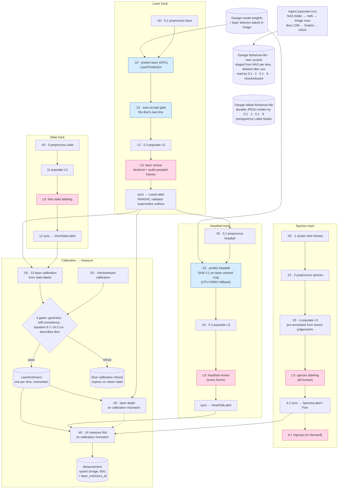
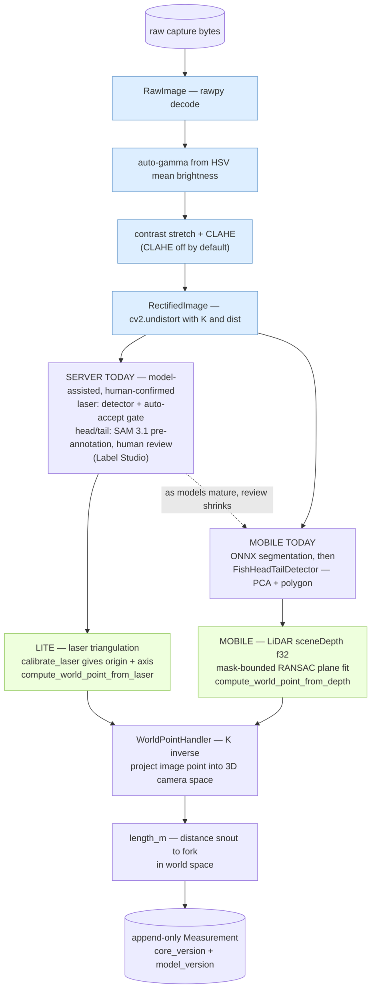

# FishSense Services — v2 Diagrams

Companion to [PLAN.md](PLAN.md). Mermaid renders natively on GitHub.

---

## 1. Deployment / component view

Where each tier actually runs. Note the control plane is **Incus + Docker-Compose (no kube)**;
only the **processor** is Kubernetes, and it **floats** (NRP today → phone cluster later).
Orchestrator and processor never call each other: both poll Temporal. The orchestrator only
scales the processor Deployments.

---

## 2. Domain model — tenancy, devices, captures

Every domain entity carries `tenant_id` (enforced by app scoping **and** Postgres RLS).
Device-specific data hangs off `Capture` via a per-`DeviceKind` extension. Laser calibration
and the dive slate are **per dive**, not per capture. They belong to the Calibration entity
(PLAN §4.3) and are referenced from each Measurement.

*Not yet drawn* (PLAN §4.3, §9.21):
- **device components** (housing/port, air lens, laser mount);
- **camera calibration** kept separate from laser calibration;
- per-dive **water conditions**;
- the **Session/Experiment** grouping used by the research repos.

---

## 3. Results, provenance & annotations

`Measurement` is **append-only** — every row records exactly what produced it, so a length is
always traceable and re-runnable. This is the core reproducibility contract.

*Not yet drawn* (see PLAN §4.3):
- **Prediction** and **Calibration** entities (producer, gates, refusal);
- the calibration and label ids each Measurement must name;
- `Label.source` (human / auto-accept / model).

"Current" semantics are open (PLAN §9.13).

---

## 4. Sequence — FishSense Lite dive-batch ingestion

Two-phase (`reserve → upload → commit`); the API never touches the bytes.

---

## 5. Sequence — Mobile offline capture, then sync

Capture works fully offline with **no network and possibly expired tokens**. Sync is
**one-way upload**; only form templates flow server → mobile.

---

## 6. Sequence — Partner onboarding and tenant scoping

How an external partner becomes a scoped identity, and how a request gets isolated.

---

## 7. Capture lifecycle

*Draft. This mixes upload state with processing state and omits states v1 has proved
necessary: priority park, calibration refusal, awaiting labels, and "tried, made no
progress". Being reworked under PLAN §9.16.*

---

## 8. Processor — dive-level stage pipeline (current `fishsense-lite`)

*Snapshot: `fishsense-lite` @ `a8b2c3bc` (2026-09-21). Source of truth: v1's `CLAUDE.md`
(stage table) and `fishsense-api-workflow-worker/worker.py` (schedules).*

The pipeline is **not one long automated run**. It is four label tracks (laser, species,
head/tail, slate), each with a **model-assisted** Label Studio loop, feeding **calibration →
depth → measure**. The orchestrator drives it with **21 hourly schedules**:
- 17 staggered by minute offset, `overlap=SKIP`;
- 4 Label Studio syncs, `ALLOW_ALL`.

Each firing selects **one dive** (`select-next/*`, `priority=HIGH`, `ORDER BY id`).
Calibration, depth and measure select on **mismatch** — a row whose recorded calibration is no
longer the dive's current one — so a recalibration re-drains everything downstream on its own.

*Pink = human-in-the-loop (Label Studio, hosted `app.heartex.com`, one project per dive per
stage). Blue = model output recorded as a prediction before any human sees it.* Not drawn:
`:25` reconcile-labeling-configs and `:55` scale-down-idle-data-worker. The data worker owns
**zero** schedules (so scale-to-zero can't drop them). The orchestrator scales its four
Deployments (cpu / light / gpu / gpu-cpu-fallback) 0↔N.

**What v2 must carry over from this picture** (PLAN §9.14, §9.16):
- the human steps;
- two calibration producers with gates and refusals;
- mismatch-driven recompute;
- per-dive priority as the commit/park flag.

---

## 9. Processor — per-capture compute path (`fishsense-core`)

The actual call chain. Two things worth reading off this: **where Lite and Mobile diverge**
(only in how depth is obtained) and **where the models have landed**. On the server, models
now propose laser points and head/tail and a human confirms them (§8). Mobile runs fully
automatic on-device.

*Blue = the preprocessing block moving from Python into the Rust core (Phase 0, `fishsense-core`
issue #54; still Python as of v4.0.0). Green = the device-specific step — the **only** place Lite and Mobile differ; both
converge on `WorldPointHandler` → length. That convergence point is exactly the extension seam
Mono/Multilens/Scout plug into. One caveat: `WorldPointHandler` is a **pinhole** (K⁻¹)
back-projection. The flat-port Lite (wuwnet, PLAN §8) is an axial refractive camera, so for it
the seam moves up a level, to a camera model dispatched in core.*

---

## Notes

- **Tenancy** is enforced twice: mandatory app-layer scoping *and* Postgres RLS keyed on a
  per-request `tenant_id` session variable.
- **The processor floats.** It is the only tier on Kubernetes, and the only place ARM64 /
  Edge TPU matter. The control plane never moves to kube in the near term.
- **Everything versioned:** `algorithm_version`, `core_version`, `model_version`,
  `template_version` — so any measurement can be explained and reproduced.
- Diagrams 4–6 all assume the **§9.1 contract**: v2-owned, and what the ported workers
  speak (v1 is retired at the big-bang cutover, PLAN §6).
