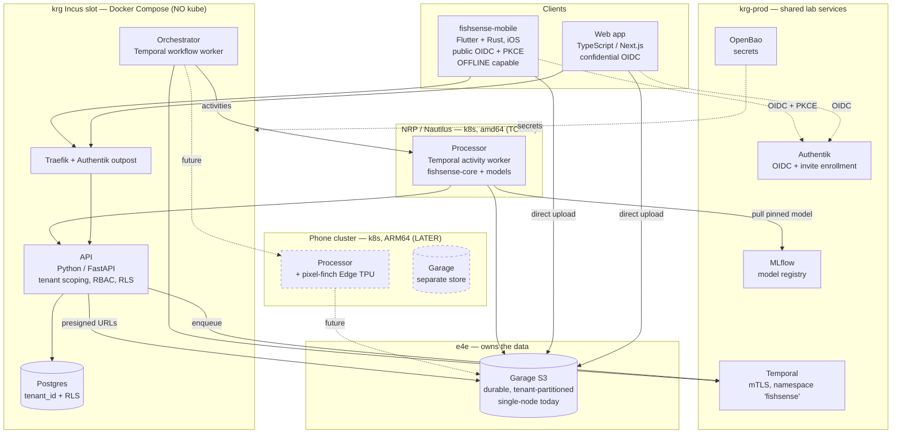
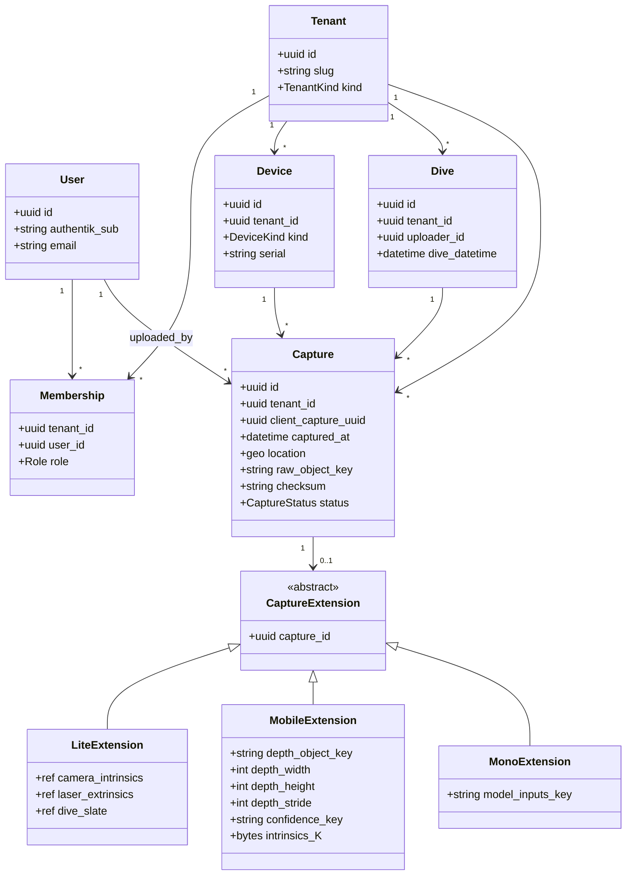
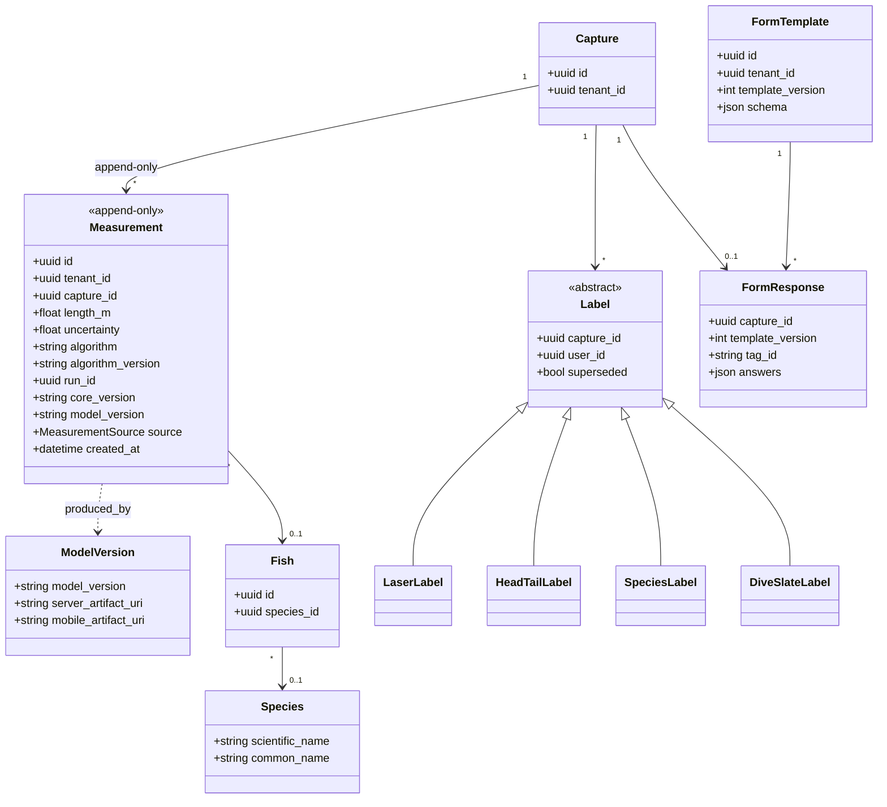
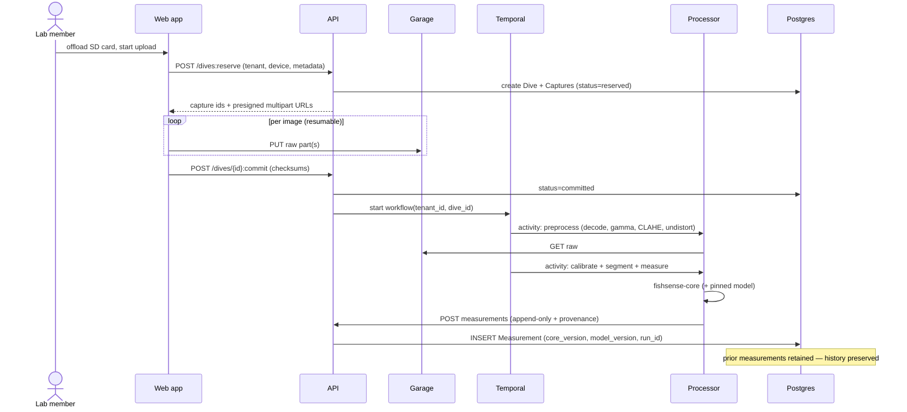
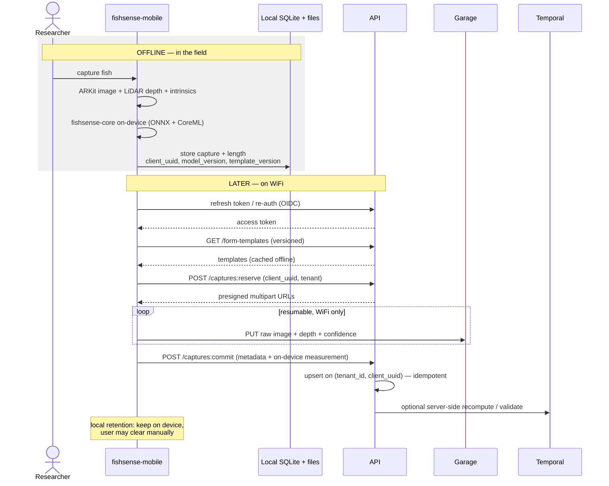
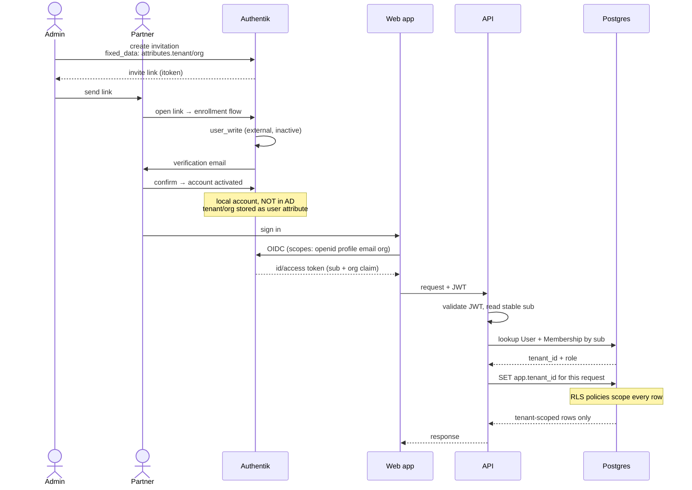
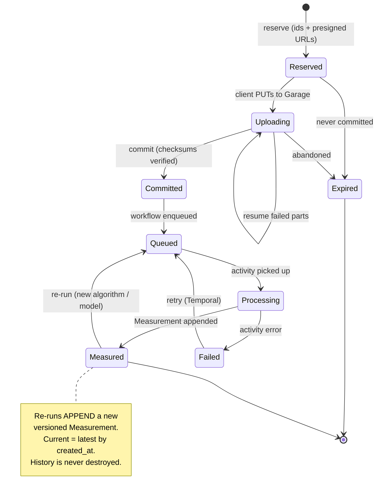
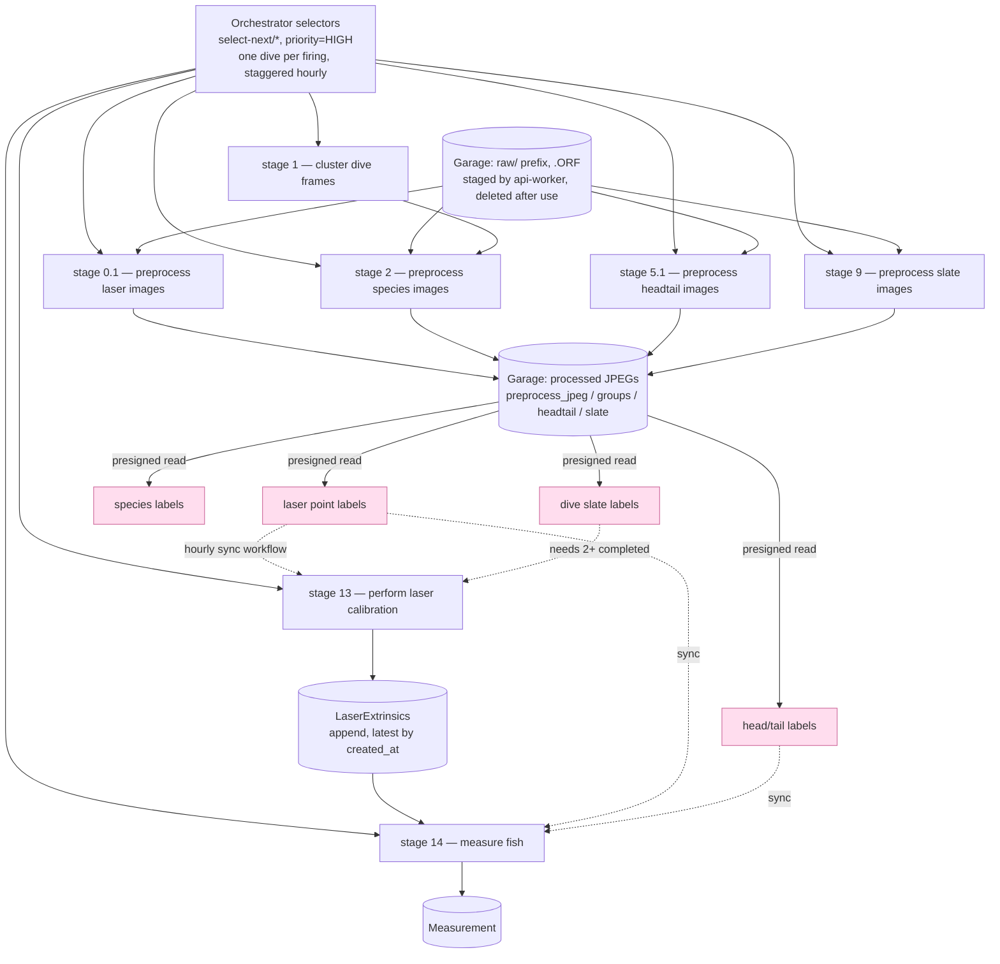
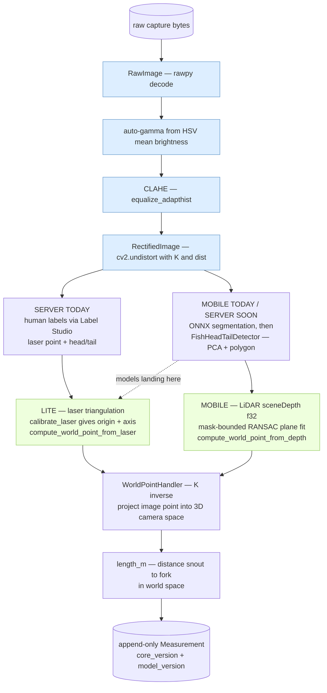

# FishSense Services — v2 Diagrams

Companion to [PLAN.md](PLAN.md). Mermaid renders natively on GitHub.

---

## 1. Deployment / component view

Where each tier actually runs. Note the control plane is **Incus + Docker-Compose (no kube)**;
only the **processor** is Kubernetes, and it **floats** (NRP today → phone cluster later).

---

## 2. Domain model — tenancy, devices, captures

Every domain entity carries `tenant_id` (enforced by app scoping **and** Postgres RLS).
Device-specific data hangs off `Capture` via a per-`DeviceKind` extension.

---

## 3. Results, provenance & annotations

`Measurement` is **append-only** — every row records exactly what produced it, so a length is
always traceable and re-runnable. This is the core reproducibility contract.

---

## 4. Sequence — FishSense Lite dive-batch ingestion

Two-phase (`reserve → upload → commit`); the API never touches the bytes.

---

## 5. Sequence — Mobile offline capture, then sync

Capture works fully offline with **no network and possibly expired tokens**. Sync is
**one-way upload**; only form templates flow server → mobile.

---

## 6. Sequence — Partner onboarding and tenant scoping

How an external partner becomes a scoped identity, and how a request gets isolated.

---

## 7. Capture lifecycle

---

## 8. Processor — dive-level stage pipeline (current `fishsense-lite`)

The numbered stages as they exist today. Note this is **not one long automated pipeline** — it
is *preprocess → human labeling in Label Studio → sync labels back → calibrate → measure*.
The orchestrator drives it with hourly, staggered, `overlap=SKIP` schedules, each firing
selecting **one dive** via a `select-next/*` selector.

*Pink = human-in-the-loop.* The data worker owns **zero** schedules (so scale-to-zero can't
drop them) and is scaled 0↔1 by the orchestrator.

---

## 9. Processor — per-capture compute path (`fishsense-core`)

The actual call chain. Two things worth reading off this: **where Lite and Mobile diverge**
(only in how depth is obtained) and **where the incoming models land** (replacing human
keypoint labeling on the server, converging on what mobile already does).

*Blue = the preprocessing block moving from Python into the Rust core (Phase 0, `fishsense-core`
issue #54). Green = the device-specific step — the **only** place Lite and Mobile differ; both
converge on `WorldPointHandler` → length. That convergence point is exactly the extension seam
Mono/Multilens/Scout plug into.*

---

## Notes

- **Tenancy** is enforced twice: mandatory app-layer scoping *and* Postgres RLS keyed on a
  per-request `tenant_id` session variable.
- **The processor floats.** It is the only tier on Kubernetes, and the only place ARM64 /
  Edge TPU matter. The control plane never moves to kube in the near term.
- **Everything versioned:** `algorithm_version`, `core_version`, `model_version`,
  `template_version` — so any measurement can be explained and reproduced.
- Diagrams 4–6 all assume the **§9.1 contract**, which is v2-owned and only optionally
  adopted by v1.
